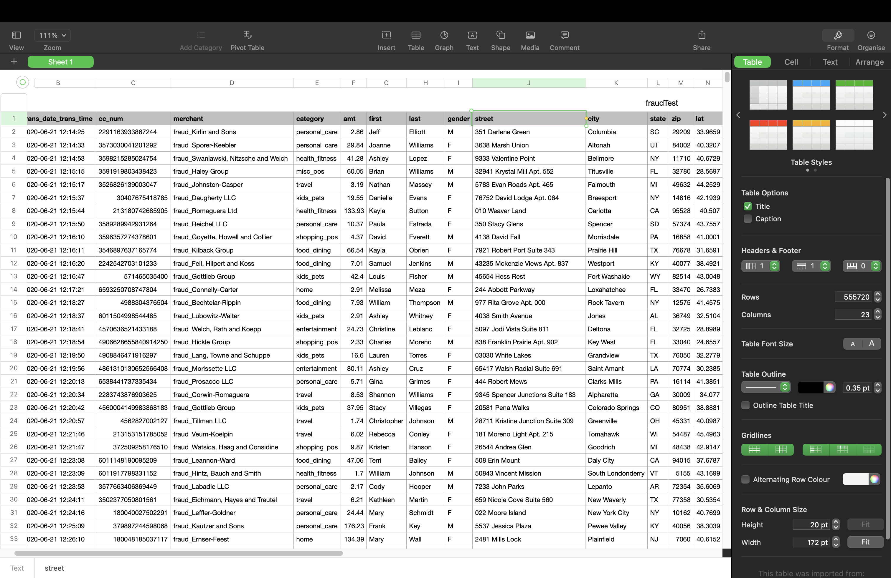
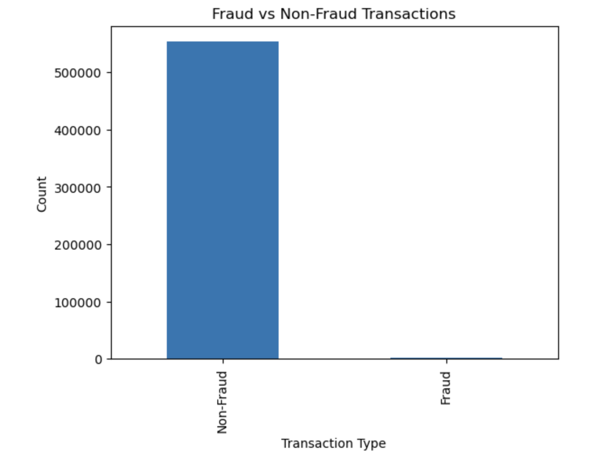
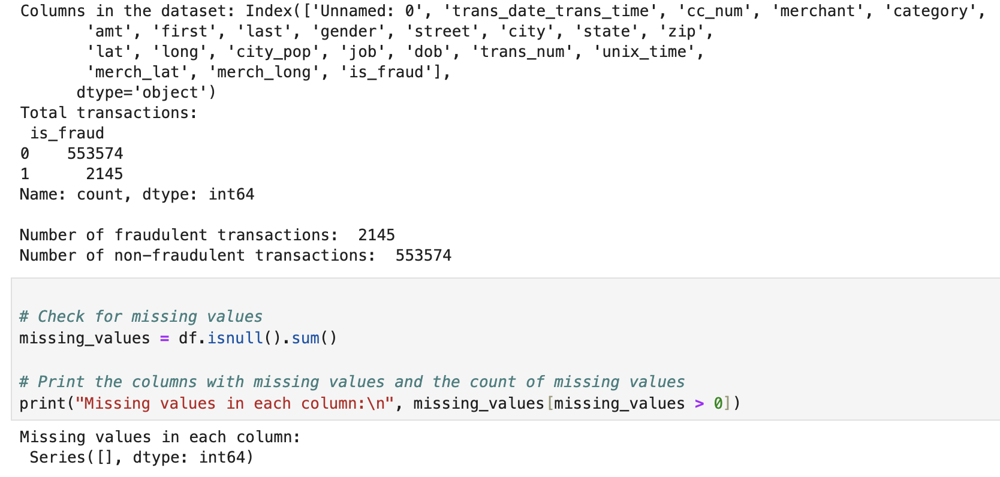

# Detect Fraudulent Credit Card Transactions

## Project Overview
The objective of this project is to develop a robust and efficient machine learning model to detect fraudulent credit card transactions. Credit card fraud is a significant issue in the financial industry, leading to substantial financial losses for banks and consumers. By leveraging data science and machine learning techniques, this project aims to identify fraudulent transactions with high accuracy, thus minimizing the impact of fraud on the financial ecosystem.

### Dataset Acquisition and Initial Exploration
- **Tasks:**
  - Received the dataset `fraudTest.csv` from the client.
  - Started initial exploration of the dataset to understand its structure and content.

- **Details:**
  - The dataset includes various features related to credit card transactions.
  - Initial observations about the data structure, missing values, and data types.

- **Initial exploration of the dataset 'fraudTest.csv':** 
  

### Exploratory Data Analysis (EDA)

#### Data Understanding and Overview
- **Tasks:**
  - Investigated the distribution of classes in the dataset.
  - Analyzed the feature types and the presence of missing values.

- **Details:**
  - **Class Distribution:** The dataset has a class imbalance problem with a significantly lower number of fraudulent transactions compared to legitimate ones.
  - **Feature Types:** Features include categorical variables, numerical features, and possibly timestamps.

- **Class Distribution:**                                                    **Feature Types and Missing Values:** 
  

    
    
  

