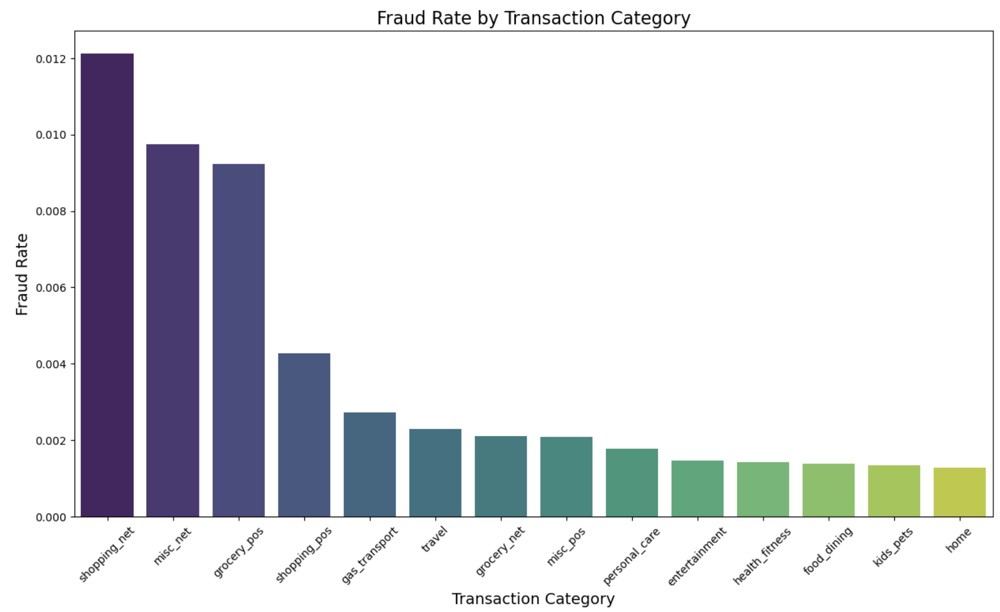
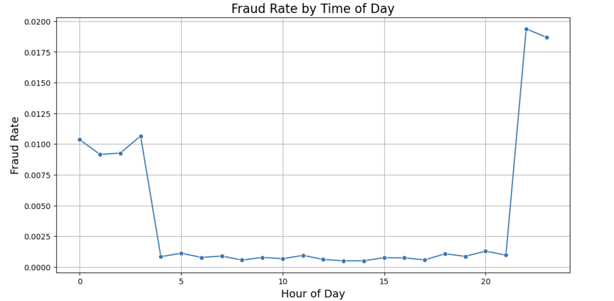
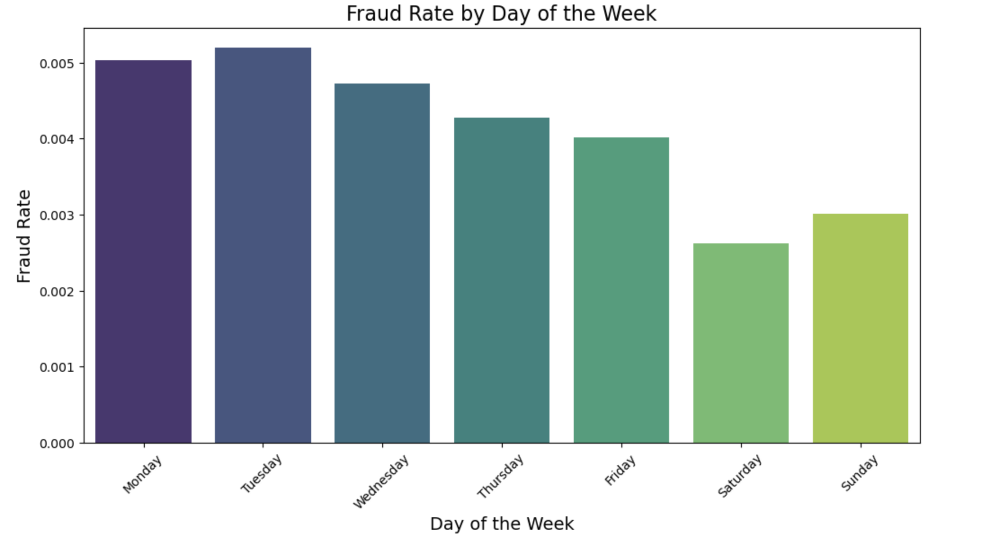
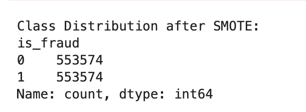
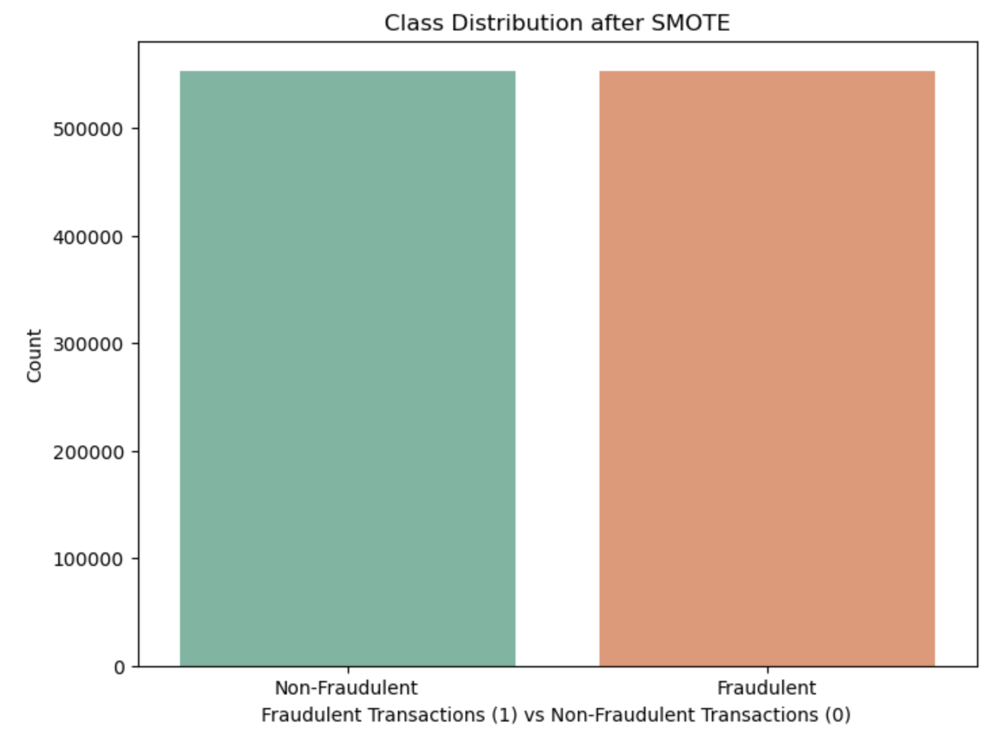

# Detect Fraudulent Credit Card Transactions

## Project Overview
The objective of this project is to develop a robust and efficient machine learning model to detect fraudulent credit card transactions. Credit card fraud is a significant issue in the financial industry, leading to substantial financial losses for banks and consumers. By leveraging data science and machine learning techniques, this project aims to identify fraudulent transactions with high accuracy, thus minimizing the impact of fraud on the financial ecosystem.

### Dataset Acquisition and Initial Exploration
- **Tasks:**
  - Received the dataset `fraudTest.csv` from the client.
  - Started initial exploration of the dataset to understand its structure and content.

- **Details:**
  - The dataset includes various features related to credit card transactions.
  - Initial observations about the data structure, missing values, and data types.

- **Initial exploration of the dataset 'fraudTest.csv':** 
  

### Exploratory Data Analysis (EDA)

#### Data Understanding and Overview
- **Tasks:**
  - Investigated the distribution of classes in the dataset.
  - Analyzed the feature types and the presence of missing values.

- **Details:**
  - **Class Distribution:** The dataset has a class imbalance problem with a significantly lower number of fraudulent transactions compared to legitimate ones.
  - **Feature Types:** Features include categorical variables, numerical features, and possibly timestamps.

### Class Distribution

  

This image illustrates the distribution of classes (fraudulent vs. non-fraudulent transactions) in the dataset.

### Feature Types and Missing Values

  

This image provides insights into the types of features present in the dataset and highlights any missing values. There were no missing values found in the provided dataset.

#### 2.2 Data Visualization
- **Tasks:**
  - Created visualizations to identify patterns or anomalies in the data.
  - Calculated Fraud rate per category
  - Calculated Fraud rate by time of day
  - Calculated Fraud rate by day of the week

- **Details:**
  - **Distribution of Transaction Amounts:** Visualized the differences in transaction amounts between fraudulent and non-fraudulent transactions.
  - **Fraud rate per category:** Explored the relationships between different categories and their findings on why certain categories might have higher fraud rates compared to others.
  - **Fraud rate by time of day:** Early and late hour showed significant increase in fraud rates compared to normal hours.
  - **Fraud rate by day of the week:** Weekends had lower fraud rates than that of weekdays

### Visualizations

  
  

  

#### Handling Missing Data
- **Tasks:**
  - Identified and handled missing values in the dataset.
  - Dropped non-numeric or irrelevant columns.
  - Encoded categorical variables.

#### Applying SMOTE
SMOTE (Synthetic Minority Over-sampling Technique) is used to address class imbalance in datasets by generating synthetic samples for the minority class. This helps balance the class distribution, improving the performance of machine learning models in detecting rare events, such as fraudulent transactions.
- **Tasks:**
  - Applied SMOTE to address class imbalance.

  
  

#### Key Steps in SMOTE:
1. **Select Minority Instances:** Randomly choose instances from the minority class.
2. **Find Nearest Neighbors:** Identify the k-nearest neighbors for each selected instance.
3. **Generate Synthetic Samples:** Create new samples by interpolating between the selected instance and its neighbors.

### Why Use SMOTE?

In many real-world datasets, especially in fields like fraud detection, healthcare, and rare event prediction, the class distribution is often imbalanced. This means that the number of instances of one class (e.g., legitimate transactions) significantly outweighs the number of instances of the other class (e.g., fraudulent transactions). This imbalance can cause several problems for machine learning models:

1. **Bias Towards Majority Class:** Models tend to be biased towards the majority class, predicting the majority class more often and ignoring the minority class.
2. **Poor Performance on Minority Class:** The model's performance on the minority class, which is often the class of interest (e.g., fraud cases), is poor. Metrics like precision, recall, and F1-score for the minority class are usually low.
3. **Overfitting:** Simply duplicating the minority class instances (over-sampling) can lead to overfitting, where the model learns the noise in the minority class rather than its true characteristics.

### Cost-Sensitive Learning

Cost-sensitive learning is a technique used to handle imbalanced datasets by assigning different misclassification costs to different classes. This approach penalizes the model more for misclassifying instances of the minority class, encouraging the model to pay more attention to the minority class and improving its performance on that class.

#### Key Steps in Cost-Sensitive Learning:
1. **Define Misclassification Costs:** Assign higher costs to misclassifying minority class instances and lower costs to misclassifying majority class instances.
2. **Modify the Learning Algorithm:** Adjust the learning algorithm to minimize the total misclassification cost rather than the total number of misclassifications.
3. **Train the Model:** Train the model using the modified algorithm, which now takes misclassification costs into account.

## Comparision on the sampling methods

### SMOTE (Synthetic Minority Over-sampling Technique)

**Pros:**
- **Addresses Class Imbalance:** Effectively generates synthetic samples for the minority class, improving its representation in the dataset.
- **Preserves Information:** Creates synthetic instances rather than duplicating existing ones, maintaining the diversity of the dataset.
- **Reduced Overfitting:** Helps in reducing overfitting compared to simple oversampling techniques.

**Cons:**
- **Dependency on Neighborhood:** SMOTE's effectiveness depends on the proper selection of neighbors for synthetic sample generation.
- **Potential Noise:** Generated synthetic samples may introduce noise if not properly tuned.
- **Computationally Intensive:** The process of generating synthetic samples can be computationally expensive for large datasets.

### Cost-Sensitive Learning

**Pros:**
- **Customized Loss Function:** Allows for the incorporation of misclassification costs, prioritizing correct classification of the minority class.
- **Flexible Application:** Can be applied to various machine learning algorithms by adjusting the cost parameters.
- **Handles Imbalance Naturally:** Adjusts the learning process to focus more on minority class samples without the need for oversampling or undersampling.

**Cons:**
- **Complex Model Tuning:** Requires careful tuning of cost parameters to achieve optimal performance.
- **Domain Knowledge Required:** Understanding the relative costs of different types of misclassifications is crucial but not always straightforward.
- **Potential Overfitting:** Poorly tuned cost-sensitive learning models can lead to overfitting, especially with highly imbalanced datasets.

### Evaluation Criteria

- **Performance Metrics:** Evaluate models using metrics such as precision, recall, F1-score, and ROC AUC score, focusing on the performance of the minority class.
- **Model Compatibility:** Assess how well SMOTE and cost-sensitive learning techniques integrate with various machine learning algorithms used in this project.
- **Computational Efficiency:** Consider the computational resources required by each method, especially with large datasets.

### Decision Process

1. **Model Testing:** Apply SMOTE and cost-sensitive learning techniques individually with different models (e.g., logistic regression, random forest, neural networks).
2. **Performance Comparison:** Compare the performance metrics of each model variant using cross-validation or hold-out validation methods.
3. **Iterative Improvement:** Based on initial results, fine-tune parameters and adjust methodologies to optimize model performance.
4. **Final Selection:** Select the sampling method (SMOTE or cost-sensitive learning) that consistently improves the performance of the models across relevant metrics.

### Future Considerations

- **Scalability:** Consider the scalability of the chosen method for deployment in real-world applications.
- **Additional Techniques:** Explore hybrid approaches or ensemble methods that combine SMOTE with cost-sensitive learning for potentially improved results.

This structured approach ensures that the chosen sampling method effectively addresses class imbalance while optimizing model performance and computational efficiency.

# Hyperparameter Tuning in Machine Learning

Hyperparameter tuning is the process of selecting the optimal hyperparameters for a machine learning algorithm before the training process begins. Hyperparameters control aspects of the algorithm's behavior and are set based on heuristics, prior knowledge, or trial and error.

## Key Concepts

### Hyperparameters vs. Parameters

- **Parameters:** Values learned by the model during training (e.g., weights, coefficients).
- **Hyperparameters:** Configuration variables that dictate the training process (e.g., learning rate, number of hidden layers, regularization strength).

### Importance of Hyperparameter Tuning

- Optimal hyperparameter values significantly impact model performance, affecting accuracy, convergence speed, and generalization ability.
- Poorly chosen hyperparameters can lead to suboptimal performance, such as slow convergence or overfitting.

## Methods of Hyperparameter Tuning

- **Manual Search:** Adjusting hyperparameters manually based on intuition and trial runs.
- **Grid Search:** Systematically evaluating combinations of hyperparameter values.
- **Random Search:** Randomly selecting hyperparameter combinations to efficiently explore a broader space.
- **Bayesian Optimization:** Using probabilistic models to determine optimal hyperparameters based on past evaluations.
- **Automated Hyperparameter Tuning:** Tools and libraries automate the search for optimal hyperparameters based on predefined metrics (e.g., GridSearchCV, RandomizedSearchCV, KerasTuner, Optuna).

## Process of Hyperparameter Tuning

1. **Define Hyperparameters:** Identify which hyperparameters to optimize based on their impact on model performance.
2. **Choose Search Method:** Select a hyperparameter optimization technique based on computational resources and the hyperparameter space size.
3. **Set Evaluation Metrics:** Define metrics (e.g., accuracy, precision, recall) to evaluate model performance during hyperparameter tuning.
4. **Execute Search:** Run experiments with different hyperparameter combinations, typically using cross-validation to mitigate overfitting and assess generalizability.
5. **Evaluate Results:** Compare model performance across different hyperparameter settings and select the combination that yields the best results on validation data.
6. **Deploy Model:** Use the tuned hyperparameters to train the final model on the entire dataset and deploy it for inference or further evaluation.

Hyperparameter tuning is a critical step in optimizing model performance and ensuring robustness across various datasets and applications.

